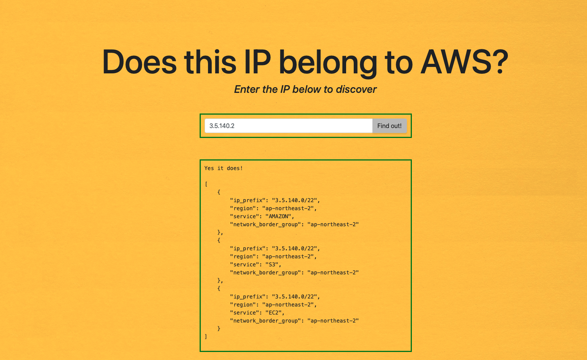

# Does this IP belong to AWS?
This repository contains helpers to determine whether an IP belongs to AWS, 
and if it does, which AWS service and region use it.

# HTML
This helper relies on JSONata, a powerful query and transformation language for JSON.
See https://jsonata.org

You can find the raw script in this repo or visit [does-this-ip-belong-to-aws.terracloud.fr](https://does-this-ip-belong-to-aws.terracloud.fr) to see it in action!

[](https://does-this-ip-belong-to-aws.terracloud.fr)

# Python script
For use in a shell, a convenient python script using only base libraries.

Example: `python3 awsip.py 3.5.140.3 ` returns:
```
[
    {
        "ip_prefix": "3.5.140.0/22",
        "region": "ap-northeast-2",
        "service": "AMAZON",
        "network_border_group": "ap-northeast-2"
    },
    {
        "ip_prefix": "3.5.140.0/22",
        "region": "ap-northeast-2",
        "service": "S3",
        "network_border_group": "ap-northeast-2"
    },
    {
        "ip_prefix": "3.5.140.0/22",
        "region": "ap-northeast-2",
        "service": "EC2",
        "network_border_group": "ap-northeast-2"
    }
]
```

# Author
Paul SANTUS, an independant AWS Cloud Consultant
* Company website: https://www.terracloud.fr
* LinkedIn: https://www.linkedin.com/in/paulsantus/